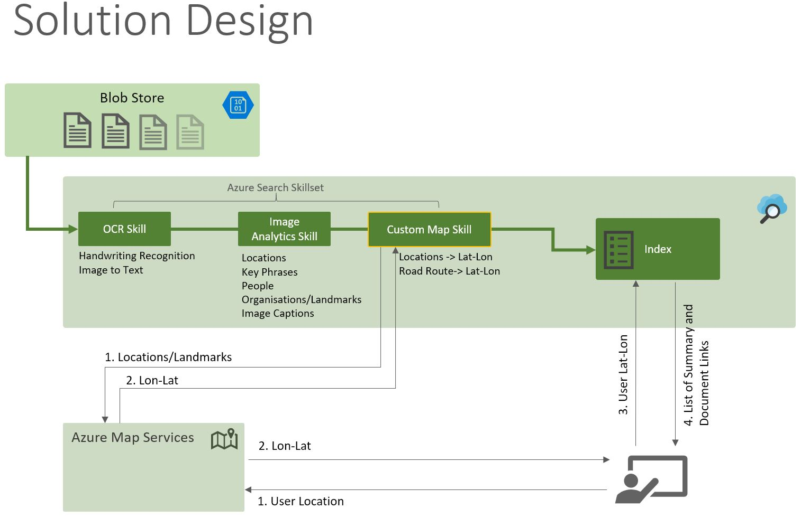

# Document Smart
## A Contextual Document Search Project

This project exemplifies the benefit of using Azure Search and other cognitive services for documents search.
Objective here is to develop a solution which allows users to search documents based on their location of interest.

Azure Search already provides a great [full index search feature](https://docs.microsoft.com/en-us/azure/search/search-lucene-query-architecture) which can used to search the documents ingested by the index. 
More recently, Azure Search added a feature called [Cognitive Search](https://docs.microsoft.com/en-us/azure/search/cognitive-search-concept-intro). Cognitive Search allows you to inject components in the indexing pipeline to enrich the document before it is indexed. These smart components are known as skills and the pipeline is known as SkillSet in Azure Search terminology.
You can select on the built-in skills like OCR, Sentiment, NamedEntityRecognition, a full list is provided [here](https://docs.microsoft.com/en-us/azure/search/cognitive-search-predefined-skills). 
Additionally, you can also inject a custom skill/component in the pipeline, which is a very powerful feature as it allows you to augment any information in the indexed document as per your requirements.

In our solution we are using the following skills-
1.	[OcrSkill](https://docs.microsoft.com/en-us/azure/search/cognitive-search-skill-ocr)- to extract the textual information from the images in the document.
2.	[MergeSkill](https://docs.microsoft.com/en-us/azure/search/cognitive-search-skill-textmerger)- to merge the above textual information with the content on the document.
3.	[NamedEntityRecognitionSkill](https://docs.microsoft.com/en-us/azure/search/cognitive-search-skill-named-entity-recognition)- to extract the following information-
a.	Locations (e.g. Thurrock, Cobham)
b.	Landmarks (e.g. The Shard)
4.	[WebApiSkill (Custom Skill)](https://docs.microsoft.com/en-us/azure/search/cognitive-search-create-custom-skill-example)- to extract the longitude-latitude from locations\landmarks provided to it from the previous skill. This skill connects to Azure Map services to do so.



#### Primary Technology Stack-
1.	Azure Search
2.	Azure Cognitive Services
3.	Azure Maps
4.	Azure Functions

#### Code/Configuration-
Solution consist of the following code/configuration artefacts-
1. Azure Search Artefacts (REST API calls, Postman Project)-
  - Data Source- a blob store where documents are kept for indexing.
  - Index- to store specific fields (locations, lon-lats etc.) for searching.
  - Indexer- to index the documents in the data source using the configured skillset (pipeline).
  - SkillSet- a pipeline configured with built-in and custom skills. 

2. Azure Function Artefacts-
  - Visual Studio Project for Azure Function, a custom skill for extracting lon-lats using Azure Map service.

#### Indexed Document Example-
```json
{
    "@odata.context": "https://msftltc.search.windows.net/indexes('ltcdocs')/$metadata#docs",
    "value": [
        {
            "@search.score": 1,
            "metadata_storage_path": "aHR0cHM6Ly9sdGNtc3NhMDFwb2MuYmxvYi5jb3JlLndpbmRvd3MubmV0L3RyaWFsL0Rlc2lnbiwlMjBjb25zdHJ1Y",
            "locations": [               
                "Tilbury",
                "Mardyke",
                "River Thames"                          
            ],
            "lonlats": [
                {
                    "type": "Point",
                    "coordinates": [
                        151.95874,
                        -27.45966
                    ],
                    "crs": {
                        "type": "name",
                        "properties": {
                            "name": "EPSG:4326"
                        }
                    }
                },
                {
                    "type": "Point",
                    "coordinates": [
                        0.35508,
                        51.46229
                    ],
                    "crs": {
                        "type": "name",
                        "properties": {
                            "name": "EPSG:4326"
                        }
                    }
                },
                {
                    "type": "Point",
                    "coordinates": [
                        -7.64094,
                        52.5846
                    ],
                    "crs": {
                        "type": "name",
                        "properties": {
                            "name": "EPSG:4326"
                        }
                    }
                }              
            ]
        }
    ]
}
```
#### Lambda Expression in Search Filter-
This is a new feature of Azure Search which comes very handy here, it allows you to search in collection field for example. In our case search would like something like this-
$filter=lonlats/any(lonlats: geo.distance(lonlats, geography'POINT( 0.35508 51.46229)') lt 10)

This will return documents (from the index) which have locations within the 10 kilometers of the provided lon-lat/coordinates. 

#### Running Postman Collection
Please change the following in the requests as per your environment-
- All Requests- api-key to your Azure Search Key, in Http Header section.
- CreateDataSource- connectionString to your storage account connection string (this is where the documents are stored for indexing).
- CreateSkillSet- 'uri' in 'Microsoft.Skills.Custom.WebApiSkill' to your Azure Function.

#### Further Possibilities-
You can use this design to enhance you indexed documents in any way you like, some examples which springs to mind are-
1. Content Moderation
2. Content Sentiment Analysis

